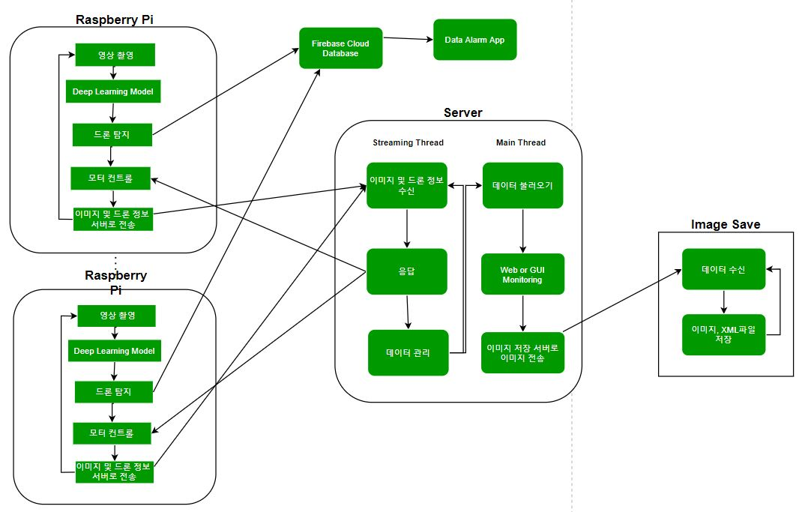

# Anti-Drone

1. [프로젝트 설명](#프로젝트_설명)
2. [프로젝트 구조](#프로젝트_구조)
3. [실행 환경](#개발_환경)
4. [향후 계획](#향후_계획)
5. [License](#License)
6. [Other license](#Other license)
-----------------------

### 프로젝트_설명
>‘드론비행금지구역의 영공’을 카메라를 통해 로봇이 실시간 모니터링하고 드론이 나타날 시 이를 감지하고 위치와 시간, 사진을 컨트롤센터에 전송한다. 본 프로젝트는 ‘드론 탐지’와 ‘실시간 모니터링’ 과 ‘알람 서비스’, ‘즉각 반응’이 가능한 로봇을 드론비행 금지구역(원전시설, 군사시설 등과 같은)에 배치하여 그 지역을 지키는 것이다. 

### 프로젝트_구조

>##### Raspberry Pi
>* 총 4대의 라즈베리파이에서 각각 카메라로 영상을 촬영한다. 
>* 촬영한 이미지를 학습된 SSD 모델을 통해 드론을 탐지하고 모터를 제어하여 카메라가 드론을 따라다니게 한다.
>* 드론 예측을 통해 얻은 결과 데이터와 촬영한 이미지를 서버에 전송한다.

>##### 서버
>* 컨트롤센터에서는 라즈베리파이의 이름별로 데이터를 수신받고, 수신받은 라즈베리파이 기준 좌우의 라즈베리파이의 상태를 응답 신호로 보낸다.
>* 수신 받은 영상 및 데이터 Flask를 이용해 Web으로 배포 또는 Pyqt로 구현한 GUI를 통해 영상 모니터링이 가능하다.
>* 이미지 저장 신호(버튼 or 키보드)가 있으면 선택한 라즈베리파이의 이미지 및 데이터 이미지 저장 컴퓨터로 전송한다.
>    ###### 특이사항
>    서버 부분은 2가지 버전이 존재한다.
>    1. Web Version : Flask를 이용해 Web 배포하여 Web에서 모니터링
>    2. GUI Version : Pyqt5를 이용해 사용자 인터페이스를 통해 모니터링   
>    Web 버전은 여러 사람이 동시에 접속할 수 있다는 장점이 있지만 비교적 동영상 속도가 느려지는 단점이 있다. 반대로 GUI 버전은 동영상 속도는 빠르지만 한 명의 사용자만 모니터링할 수 있다. 각각의 장단점이 있어 두 버전 모두 구현하였다.

>##### 이미지 저장 컴퓨터
>* 이미지 및 데이터를 수신한다
>* 수신 받은 데이터를 기반으로 이미지와 SSD 모델 학습에 필요한 XML파일 저장한다.

### 개발_환경
>   #### 사용장비
>    * 라즈베리파이4
>    * 운영체제 : 라즈비안, Windows 10
>    * 서보모터 : MG996R
>    * Google Coral TPU 
>    * USB Webcam

>   #### Software
>    * Python 3.7.6
>    * opencv 4.2.0
>    * imutils 0.5.3
>    * numpy 1.18.5
>    * tensorflow 2.1.0

### 향후_계획
>* 발사체 구현(ex 레이저)
>* 2D 레이더 맵 구현
>* 수동 조작 GUI 구현
>* 새로운 3D 모델 뽑아서 적용하기

### License
This project is released under the Pyqt5 is GPL v3 licensed, as found in the [LICENSE](LICENSE) file.

### Other license
We Notice Other license too.
Some code is licensed user a MIT license. Some code is licensed user BSD and Apache licese.
and we notice someone's code that we refered
Check this file [NOTICE](NOTICE)
